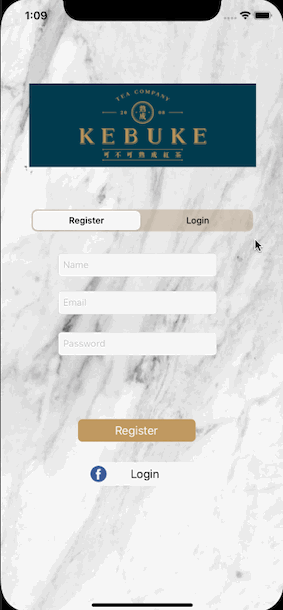
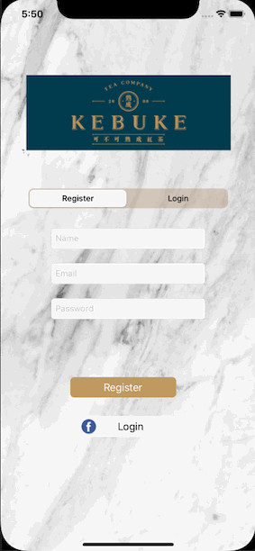

# Group Orders
A group order app allowing users to create, edit, and delete orders.

<ul>
<li>Store order data in Google Excel sheet. Utilise SheedDB API to communicate with Google Excel sheet</li>
<li>Store and read menu data in plist</li>
<li>Able to create, edit and delete orders</li>
<li>Able to create account and login through Firebase Authentication SDK and Facebook SDK</li>
</ul>
 
<h3 class="code-line" data-line-start=0 data-line-end=1 >Medium Articles</h3> 
For more details about this app, please see Medium articles:  <a href="https://medium.com/%E5%BD%BC%E5%BE%97%E6%BD%98%E7%9A%84-swift-ios-app-%E9%96%8B%E7%99%BC%E6%95%99%E5%AE%A4/swift-%E7%B7%B4%E7%BF%92-group-orders-1-restful-api-plist-decoder-swipeable-cell-4a19ac31f21c">Group Orders訂飲料 #1 RESTful API, Swipeable Cell, Plist Decoder</a>  <a href="https://medium.com/%E5%BD%BC%E5%BE%97%E6%BD%98%E7%9A%84-swift-ios-app-%E9%96%8B%E7%99%BC%E6%95%99%E5%AE%A4/swift-%E7%B7%B4%E7%BF%92-group-orders%E8%A8%82%E9%A3%B2%E6%96%99-2-firebase-sdk-facebook-sdk-dd5ef07f5e1a">Group Orders訂飲料 #2 Firebase SDK, Facebook SDK</a>
 

<h1 class="code-line" data-line-start=0 data-line-end=1 >Demo</h1>
<h3 class="code-line" data-line-start=1 data-line-end=2 >Register &amp; Login</h3>
<ul>
<li class="has-line-data" data-line-start="2" data-line-end="4">Facebook Login 
</li>
<li class="has-line-data" data-line-start="4" data-line-end="6">Firebase Password-Based Accounts 
 </li>
<li class="has-line-data" data-line-start="6" data-line-end="9">Error Message 
</li>
</ul>
<h3 class="code-line" data-line-start=9 data-line-end=10 >Add, Edit, and Delete Orders</h3>
<ul>
<li class="has-line-data" data-line-start="10" data-line-end="12">Add an item 
</li>
<li class="has-line-data" data-line-start="12" data-line-end="14">Edit and Delete an item 
</li>
</ul>
