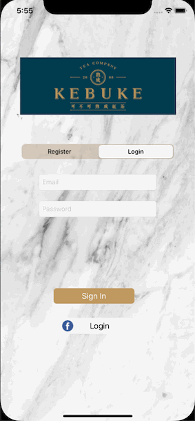

# Group Orders
A group order app allowing users to create, edit, and delete orders.

<ul>
<li>Store order data in Google Excel sheet. Utilise SheedDB API to communicate with Google Excel sheet</li>
<li>Store and read menu data in plist</li>
<li>Able to create, edit and delete orders</li>
<li>Able to create account and login through Firebase Authentication SDK and Facebook SDK</li>
</ul>

<h2 class="code-line" data-line-start=0 data-line-end=1 >Register &amp; Login</h2>
<ul>
<li class="has-line-data" data-line-start="1" data-line-end="3">Facebook Login 
</li>
<li class="has-line-data" data-line-start="3" data-line-end="5">Firebase Password-Based Accounts 
 </li>
<li class="has-line-data" data-line-start="5" data-line-end="8">Error Message 
</li>
</ul>
<h2 class="code-line" data-line-start=8 data-line-end=9 >Add, Edit, and Delete Orders</h2>
<ul>
<li class="has-line-data" data-line-start="9" data-line-end="11">Add an item 
</li>
<li class="has-line-data" data-line-start="11" data-line-end="13">Edit and Delete an item 
</li>
</ul>
